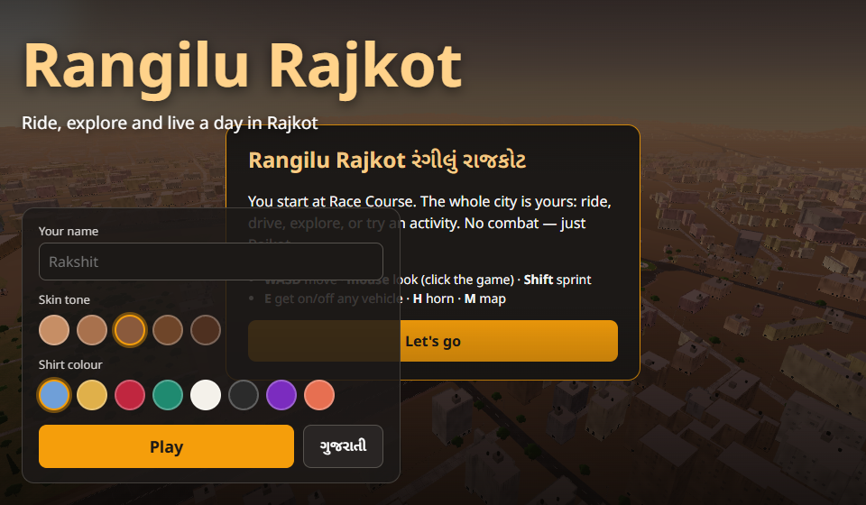
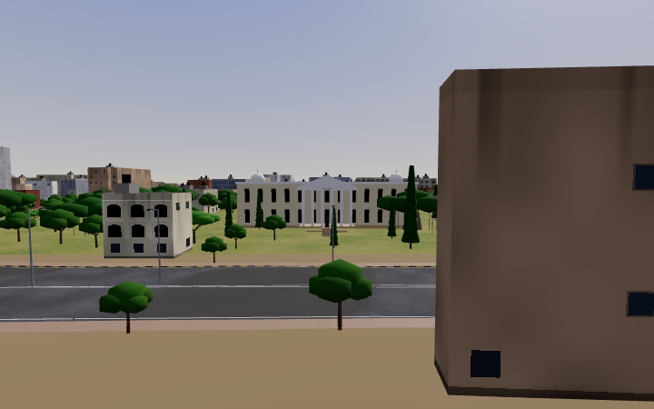
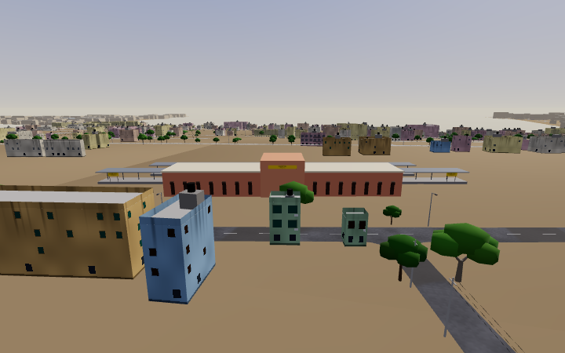
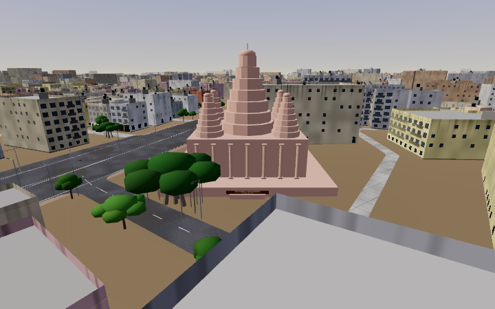
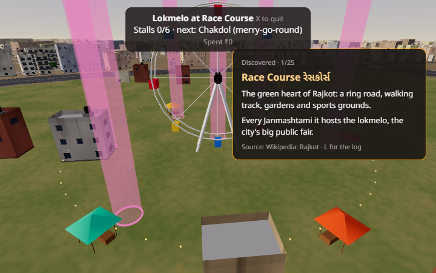
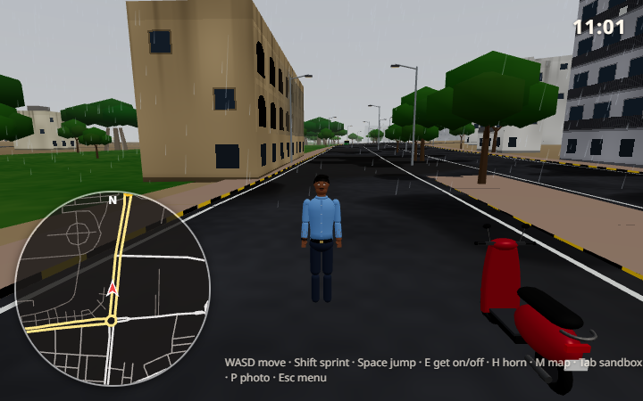
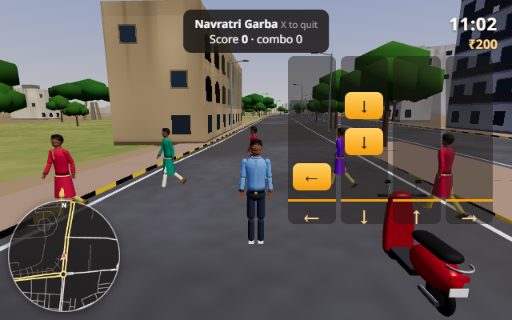
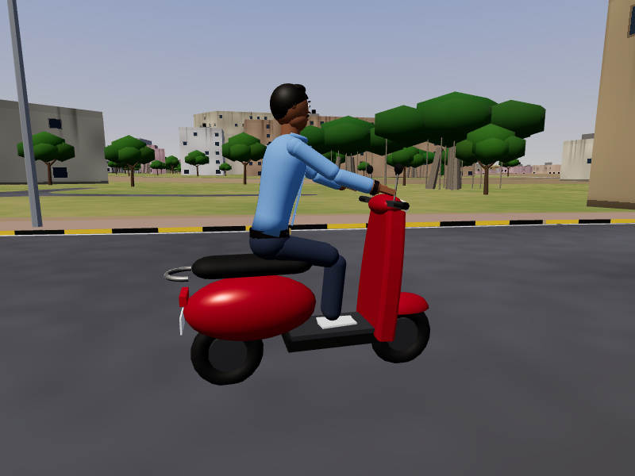
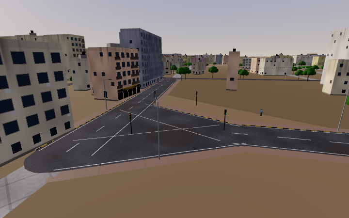

<div align="center">

# 🛵 Rangilu Rajkot · રંગીલું રાજકોટ

### The whole of Rajkot, 1:1, in your browser. Ride it. Explore it. Live a day in it.

[](https://rangilu-rajkot.pages.dev)




*No combat. No install. Just Rajkot.*

</div>

---

## ✨ What is this?

An open-world game built from **real map data** of Rajkot, Gujarat — every street, ring road, chowk, lake and
landmark in its true place. Start at Race Course at golden hour, hop on your Activa-style scooter, and go
anywhere: the old bazaars, the 150 Ft Ring Road, Aji Dam, all the way up the Morbi highway.

| | |
|---|---|
| 🗺️ **1,543 km²** of Rajkot and its villages | 🏢 **284,000** buildings with real heights |
| 🛣️ **50,000** road junctions, real one-ways | 🌳 **117,000** trees (neem, peepal, banyan, gulmohar…) |
| 🏛️ **20** hand-built landmarks | 🚦 **43** signal junctions, traffic that keeps left |

---

## 📸 A look around

<table>
<tr>
<td><br><sub><b>Watson Museum</b>, Jubilee Garden</sub></td>
<td><br><sub><b>Rajkot Junction</b> with its platforms</sub></td>
</tr>
<tr>
<td><br><sub><b>BAPS Swaminarayan Mandir</b>, Kalawad Road</sub></td>
<td><br><sub>The Janmashtami <b>Lokmelo</b> at Race Course</sub></td>
</tr>
<tr>
<td><br><sub><b>Monsoon rain</b>: wet roads, green grass, full rivers</sub></td>
<td><br><sub><b>Navratri Garba</b> rhythm game</sub></td>
</tr>
<tr>
<td><br><sub>Your scooter — or take <b>any vehicle</b> from traffic</sub></td>
<td><br><sub>Traffic signals at real junctions</sub></td>
</tr>
</table>

---

## 🎮 Things to do

| Activity | |
|---|---|
| 🛺 **Rickshaw Rides** | Pick up passengers, drive them to real places — fare + tip |
| 🥡 **Farsan Delivery** | Ganthiya, peda… or ice cream before it melts |
| 🪁 **Uttarayan Kite Fight** | Cut rival kites from the rooftops — *kai po che!* |
| 🎡 **Lokmelo at Race Course** | Giant wheel, stalls, lights, crowds |
| 💃 **Navratri Garba** | Hit the arrows on the dhol beat |
| 🏏 **Gully Cricket** | Two overs in a society lane. Mind the windows. |
| 🚌 **BRTS Driver** | Stations on the 150 Ft Ring Road, on time |
| ⏱️ **Race Course Time Trial** | One flying lap of the ring |

Plus: 🧰 a **sandbox** (spawn vehicles, ramps, cones; change time, season, weather, traffic), 🚁 a **drone
camera**, 📷 **photo mode**, 📖 a **discovery log** of landmarks with real facts, 💰 money for **outfits and street
food**, and 🌦️ **real sun position**, summer haze and monsoon rain.

**Vehicles:** 🚲 bicycle · 🛵 scooter · 🏍️ motorcycle · 🛻 chhakdo · 🛺 auto · 🚗 hatchback · 🚙 SUV · 🚌 bus · 🚜 tractor

---

## ⌨️ Controls

| Move | Ride | Explore | Menus |
|---|---|---|---|
| **WASD** move | **E** get on/off any vehicle | **M** map — double-click to teleport | **J** activities |
| **Mouse** look | **H** horn | **P** photo mode | **Tab** sandbox |
| **Shift** sprint | **Space** handbrake | **C** camera | **L** discoveries |
| **Space** jump | **R** reset / bring scooter | **T** +1 hour | **Esc** settings, keys, saves |

🎮 Gamepad and 📱 touch controls supported · every key can be remapped · English / ગુજરાતી

---

## 🛠️ Run it yourself

```bash
npm ci --prefix game
npm run dev --prefix game
```

Open **http://localhost:5173**. The world data is already in the repo — no bake needed.

<details>
<summary><b>Re-bake the world from raw map data</b> (optional, ~45 min)</summary>

```bash
python -m venv .venv
.venv/Scripts/python -m pip install -e pipeline[dev]
.venv/Scripts/python -m rajkot_bake fetch     # raw data into data/raw (~300 MB)
.venv/Scripts/python -m rajkot_bake all       # every stage
.venv/Scripts/python -m rajkot_bake private   # optional: your own home spawn (never published)
```
</details>

<details>
<summary><b>How it works</b></summary>

- **The bake** (Python, `pipeline/`) turns OpenStreetMap, Overture buildings and places, GHSL heights and the
  Copernicus elevation model into compact tiles of *facts*: outlines, heights, roads, water, trees, chowks, landmarks.
- **The game** (TypeScript + Three.js + Rapier, `game/`) generates the 3D city from those facts in Web Workers,
  seeded per object so it looks the same every run, and streams it around you.
- **Hosting**: every push to `main` deploys to Cloudflare Pages ([DEPLOY.md](DEPLOY.md)).
</details>

---

## 📚 Docs

[PLAN](PLAN.md) · [PROGRESS](PROGRESS.md) · [DECISIONS](DECISIONS.md) · [DEPLOY](DEPLOY.md) · [CREDITS](CREDITS.md) · [PROMPT](PROMPT.md)

## 📜 Licence

Code **MIT**. World data **ODbL 1.0** — © OpenStreetMap contributors, Overture Maps Foundation. See [CREDITS](CREDITS.md).

<div align="center">

Made with ❤️ in Rajkot by **Rakshit Gajera**

</div>
